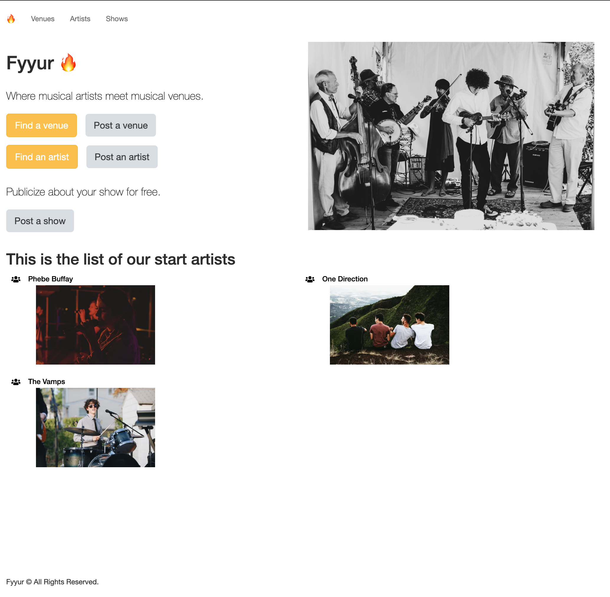
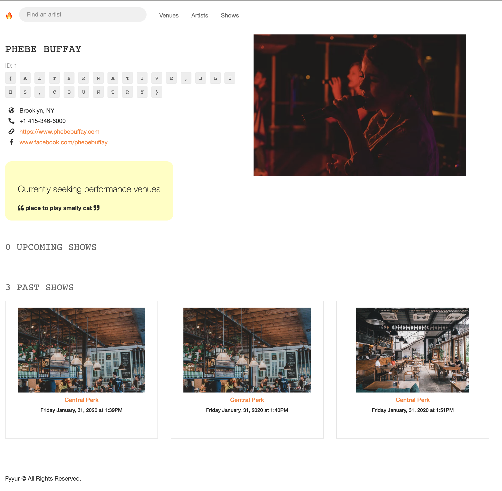
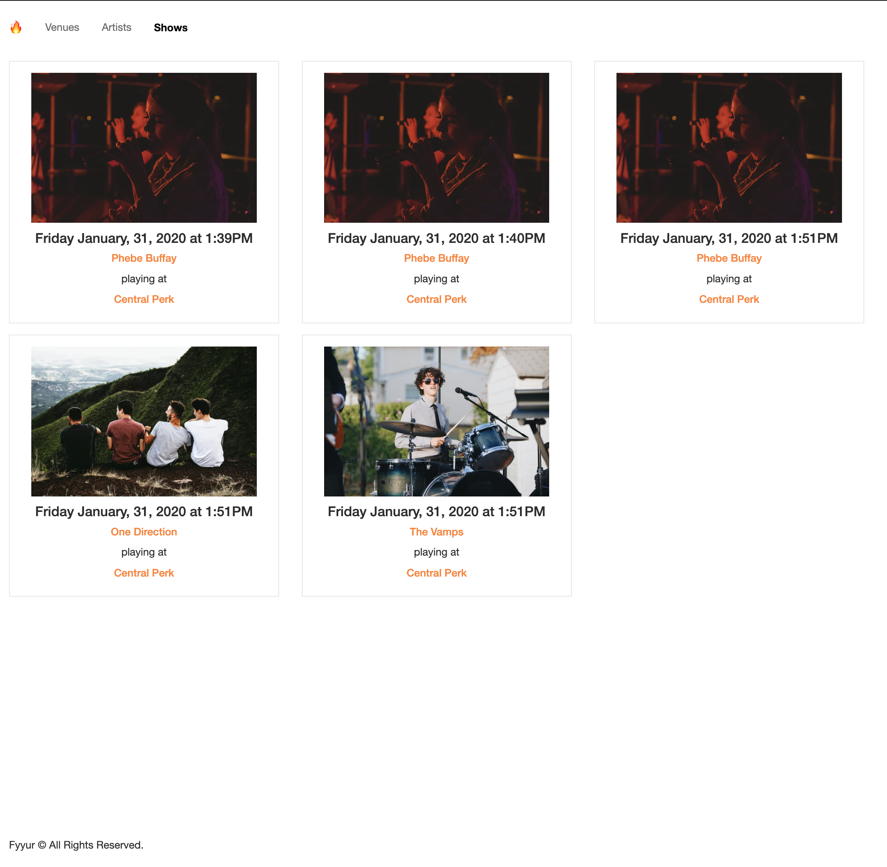
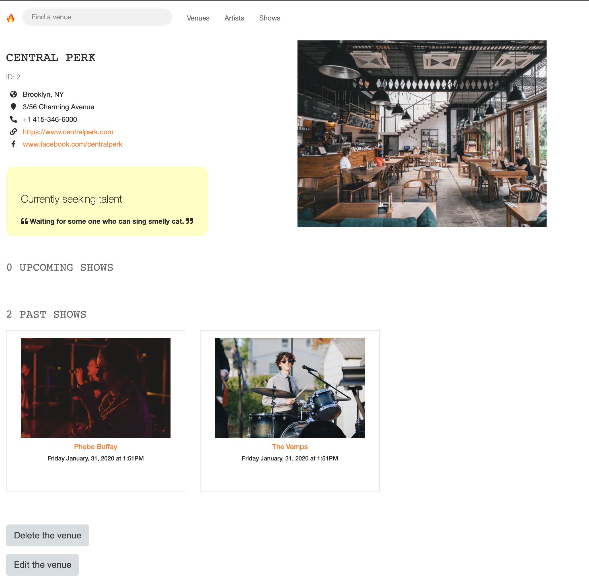

Fyyur
-----

### Introduction

Fyyur is a musical venue and artist booking site that facilitates the discovery and bookings of shows between local performing artists and venues. This site lets you list new artists and venues, discover them, and list shows with artists as a venue owner.


### Tech Stack

* **SQLAlchemy ORM** 
* **PostgreSQL** 
* **Python3** and **Flask** 
* **Flask-Migrate** 
* **HTML**, **CSS**, and **Javascript** with [Bootstrap 3]







### Development Setup

To start and run the local development server,

1. Initialize and activate a virtualenv:
  ```
  $ cd YOUR_PROJECT_DIRECTORY_PATH/
  $ virtualenv --no-site-packages env
  $ source env/bin/activate
  ```

2. Install the dependencies:
  ```
  $ pip install -r requirements.txt
  ```

3. Run the development server:
  ```
  $ export FLASK_APP=myapp
  $ export FLASK_ENV=development # enables debug mode
  $ python3 app.py
  ```

4. Navigate to Home page [http://localhost:5000](http://localhost:5000)
